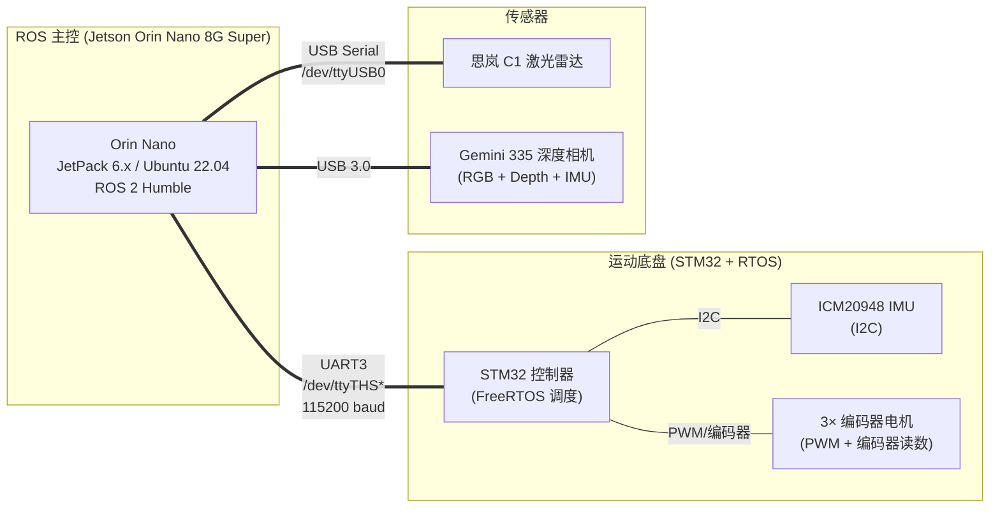
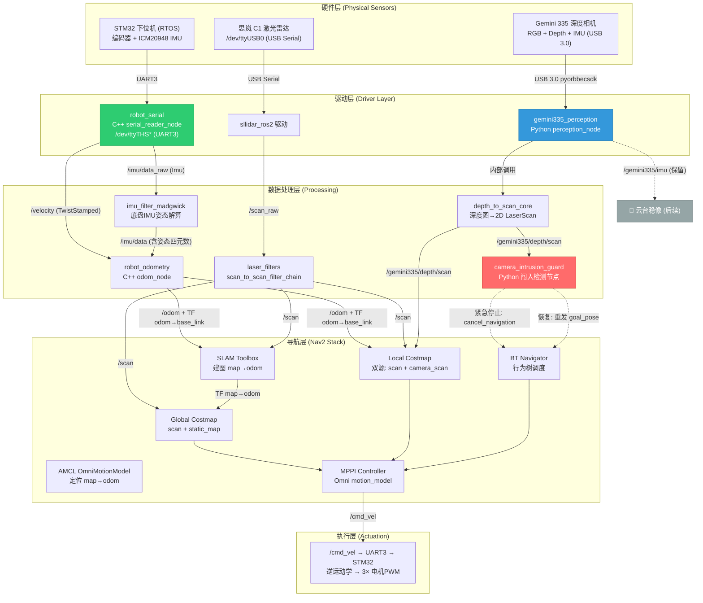
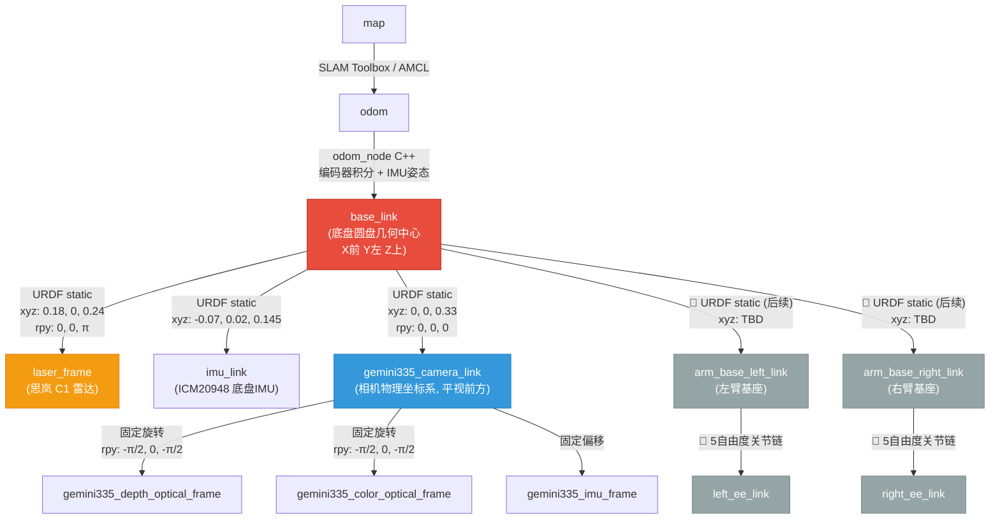
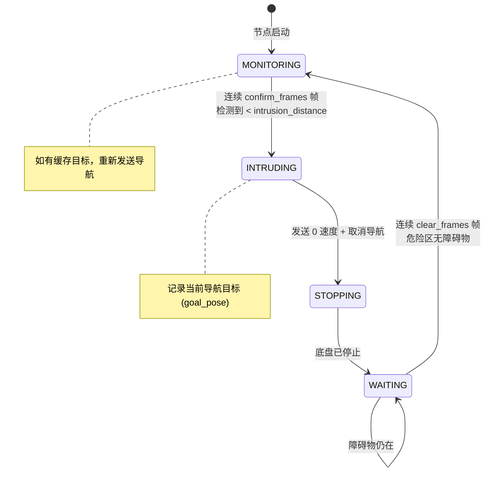

# slam_2d × gemini335_perception 整合实施计划

将底盘 2D 雷达 SLAM 导航 (`slam_2d`) 与头部深度相机感知 (`gemini335_ros2_ws_nav`) 整合为一套统一的真机 ROS 2 工作空间，运行于 **NVIDIA Jetson Orin Nano 8G (Super)**。

---

## 零、硬件架构与物理约束

### 0.1 硬件拓扑



### 0.2 底盘运动学模型

**基本假设** (来自用户确认):
1. 小车是**刚体**
2. 运动局限在**平面**上，忽略地面凹凸不平及其影响
3. 车轮**不与地面打滑**

**三轮全向轮布局**：

| 轮编号 | 安装位置 | 说明 |
|:---:|:---|:---|
| i=1 | 正前方 (X轴正方向) | 前轮 |
| i=2 | 左后方 (120°) | 左后轮 |
| i=3 | 右后方 (240°) | 右后轮 |
尺寸标注图信息:
    一、 俯视图（左侧）提取信息
    底盘外径：Φ390（底盘的整体最大外接圆直径为 390 mm）。
    轮组分布角度：120°（标注显示底盘的三个全向轮呈 120 度等角对称分布）。
    其他结构特征：顶板有大量预留的安装孔位（用于安装传感器、机械臂等）；下方镂空处可见内置的控制主板（类似树莓派或单片机控制板）。
    二、 侧视图（右侧）提取信息
    1. 右侧标注（整体及车轮参数）：
    顶板高度：176.6（从地面到底盘顶层面板上表面的高度为 176.6 mm）。
    车轮直径：Φ127（使用的全向轮/麦克纳姆轮直径为 127 mm）。
    2. 左侧标注（层级结构高度参数）：
    底盘总高度：195.1（从地面到顶板上方最高凸出部件——如急停开关或传感器——的最高点总高度为 195.1 mm）。
    中层板离地高度：91.5（从地面到底盘下层/中层主体金属板的距离为 91.5 mm）。
    层间距离：80（下层/中层主体金属板与顶板之间的支撑柱高度为 80 mm）。
    数据印证：80 + 91.5 = 171.5 mm。顶板高度为 176.6 mm，可推算顶板自身的厚度约为 5.1 mm（176.6 - 171.5），符合常见的 5mm 金属/亚克力板材厚度。
    3. 底部标注（通过性参数）：
    离地间隙：45.6（底盘中心悬挂的电机/机构最低点距离地面的高度为 45.6 mm，决定了底盘的越障通过能力）。

- **坐标原点 O**：底盘圆盘的**几何中心** = `base_link` 原点
- **X 轴**：正前方（轮 i=1 方向）
- **Y 轴**：左侧
- **旋转 ω**：逆时针为正
- **底盘半径 R**：最大外接圆直径为 390 mm

> [!NOTE]
> **`base_link` 定义已确认**：`base_link` 原点位于底盘圆盘几何中心。 Gemini 335 相机在 `base_link` 坐标系下的相对安装位置为 **(0, 0, 0.33)m**，0.33是相对于底盘上表面的高度，已确认。

### 0.3 串口设备路径修正

> [!WARNING]
> **关键硬件差异**：`slam_2d` 源码中 `serial_reader_node.cpp` 硬编码了 `/dev/ttyACM0` 作为底盘串口。但根据真机硬件架构，Orin Nano 通过**板载 UART3** (非 USB) 连接 STM32。在 Jetson 上，板载 UART 设备路径为 `/dev/ttyTHS*`（如 `/dev/ttyTHS0` 或 `/dev/ttyTHS1`，取决于 JetPack 版本和 pin 配置）。
> 
> **处理方式**：将串口路径参数化，不硬编码。通过 Launch 参数或 YAML 配置文件注入，部署时按实际接线填写。

---

## 一、设计决策（已确认）

### ✅ base_frame 统一：`base_link`

`slam_2d` 全局使用 `base_link` 作为机器人基准坐标系（里程计发布 `odom → base_link`），废弃仿真时代的 `base_footprint` 间接层。
理由：真机底盘 C++ 代码 (`odom_node.cpp`) 硬编码了 `odom → base_link`，修改底盘 C++ 代码风险远大于修改上层 Python/YAML 配置。

### ✅ 雷达链路保持不变

保留 `slam_2d` 原有的雷达处理链路：`/scan_raw` → `laser_filters` → `/scan`。SLAM Toolbox 和 Nav2 均消费过滤后的 `/scan`。

### ✅ 局部规划器：MPPI Controller

沿用 `slam_2d` 的 `nav2_params.yaml` 中已配置的 MPPI Controller（`motion_model: "Omni"`），替代仿真阶段的 DWB。

### ✅ Gemini 335 IMU 角色：独立保留

Gemini 335 的 IMU 数据**不接入** EKF 融合或里程计。原因是相机安装在头部云台之上（二轴舵机，后续拓展），其 IMU 参考系会随云台角度变化。`/gemini335/imu` 话题独立保留，供后续云台稳像、头部姿态补偿等高级功能使用。

### ✅ 底盘 IMU 芯片：ICM20948

底盘 STM32 通过 I2C 总线连接 ICM20948 九轴 IMU（加速度计 + 陀螺仪 + 磁力计）。STM32 在 RTOS 任务中采集原始数据后，通过 UART3 上传到 Orin Nano 的 `robot_serial` 节点。

---

## 二、整合后的数据流总览



---

## 三、整合后的 TF 坐标树



> [!NOTE]
> 灰色节点 (🔮) 为后续扩展的双臂部分，本阶段不实施，但 URDF 中已预留 `arm_base_left_link` 和 `arm_base_right_link` 挂载点（来自 [upper_body.xacro](file:///home/lowsing/gemini335_ros2_ws_nav/src/gemini335_perception/urdf/modules/upper_body.xacro)）。

---

## 四、整合后的话题总线 (Topic Bus)

| 话题名称 | 消息类型 | 发布者 | 订阅者 | 频率 | 备注 |
|:---|:---|:---|:---|:---:|:---|
| `/velocity` | TwistStamped | robot_serial | odom_node | ~50Hz | 底盘编码器速度 |
| `/imu/data_raw` | Imu | robot_serial | imu_filter_madgwick | ~50Hz | ICM20948 原始数据 |
| `/imu/data` | Imu | imu_filter_madgwick | odom_node | ~50Hz | 含姿态四元数 |
| `/odom` | Odometry | odom_node | Nav2 全栈 | ~50Hz | 里程计 |
| `/scan_raw` | LaserScan | sllidar_ros2 | laser_filters | 10Hz | 原始雷达数据 |
| `/scan` | LaserScan | laser_filters | SLAM / Nav2 Costmap | 10Hz | 过滤后雷达数据 |
| `/gemini335/depth/scan` | LaserScan | perception_node | Local Costmap / intrusion_guard | 30Hz | 相机虚拟光幕 |
| `/gemini335/color/image_raw` | Image | perception_node | 🔮 YOLO / 抓取 (按需) | 30Hz | **懒加载**: 无订阅者时不解码 |
| `/gemini335/depth/image_raw` | Image | perception_node | 🔮 抓取深度解算 (按需) | 30Hz | **懒加载**: 无订阅者时不解码 |
| `/gemini335/color/camera_info` | CameraInfo | perception_node | 🔮 抓取3D反投影 (按需) | 30Hz | 含 RGB 内参 fx,fy,cx,cy |
| `/gemini335/imu` | Imu | perception_node | 🔮 云台稳像 (后续) | 30Hz | 相机IMU独立 |
| `/cmd_vel` | Twist | Nav2 / teleop | robot_serial | 20Hz | 底盘控制指令 |

> [!TIP]
> **话题零冗余设计**：
> - 底盘 IMU 链路单链路无分叉：`robot_serial → /imu/data_raw → madgwick → /imu/data → odom_node`
> - `/gemini335/imu` 与 `/imu/data_raw` 天然命名空间隔离，互不干扰
> - `/scan` 仅由 `laser_filters` 产生，SLAM 和 Nav2 共享消费
> - 懒加载机制确保无人订阅 RGB/Depth 图像时不消耗 CPU 解码算力

> [!IMPORTANT]
> **后续机械臂抓取的话题预留**：当 YOLO 节点或抓取规划器订阅 `/gemini335/color/image_raw` 和 `/gemini335/depth/image_raw` 时，`perception_node` 的 `get_subscription_count()` 守卫机制会自动唤醒完整的图像解码管线。`/gemini335/color/camera_info` 提供了 3D 反投影所需的全部相机内参，无需额外标定节点。这一切**无需修改 perception_node 代码**，即插即用。

---

## 五、新增功能模块：camera_intrusion_guard 节点

### 5.1 设计理念

**这不是重型 3D 避障，而是轻量级"光幕"紧急刹车。**

Gemini 335 的 `depth_to_scan_core` 已将深度图垂直切片 (10%~90% 画面高度) 压缩为 2D LaserScan，覆盖相机前方从低到高的障碍物。本节点仅订阅该 LaserScan，判断是否有异物闯入"近距离危险区"，一旦触发则通过 Nav2 Action 暂停当前导航任务。

**典型场景**：机器人导航中，一只鸟飞掠 Gemini 335 前方 1m 内。底盘雷达因高度差无法检测，但相机的垂直切片光幕捕获到了。机器人平缓停止，等待鸟飞走后自动恢复导航。

### 5.2 核心逻辑

```python
# camera_intrusion_guard_node.py (伪代码)

class CameraIntrusionGuardNode(Node):
    """
    订阅: /gemini335/depth/scan (LaserScan)
    功能: 检测相机视野内 intrusion_distance 范围内的闯入物体
    行为: 
      - 检测到闯入 → 发送 cmd_vel = 0 (平缓刹车) + cancel Nav2 导航
      - 闯入物体消失 → 恢复之前被取消的导航目标
    """
    
    参数:
      intrusion_distance: 1.0     # 触发刹车的距离阈值 (米)
      intrusion_angle_range: 60   # 仅检测前方 ±30° 范围 (度)
      confirm_frames: 3           # 连续 N 帧检测到才触发 (防抖)
      clear_frames: 10            # 连续 N 帧未检测才恢复 (防误恢复)
      decel_rate: 0.1             # 平缓减速发布周期 (秒)
```

### 5.3 状态机



### 5.4 与 Nav2 的交互方式

- **暂停**：通过 `nav2_msgs/action/NavigateToPose` 的 `cancel_goal` 取消当前导航
- **恢复**：节点内缓存被取消时的 `goal_pose`，障碍物消失后通过相同 Action 重新发送目标
- **紧急刹车**：暂停期间以 10Hz 持续发布 `Twist` 全零速度到 `/cmd_vel`，确保底盘彻底静止（STM32 RTOS 侧也有超时安全机制，但 ROS 侧需主动保障）

> [!TIP]
> **为什么不用 Nav2 Costmap + 膨胀层处理？**
> 1. Costmap 膨胀层本质是空间代价梯度，机器人会"绕开"障碍物但不会"停下来等待"
> 2. 需求是"鸟飞来→停→鸟飞走→继续原目标"，是**时序状态机行为**，不是空间规划问题
> 3. intrusion_guard 职责单一、与 Nav2 通过 Action 松耦合，可独立启停

---

## 六、Proposed Changes（按模块分组）

---

### 工作空间结构

直接在 `slam_2d` 上扩展，将 `gemini335_perception` 包复制进 `slam_2d/src/`。

#### [NEW] 最终工作空间结构

```
slam_2d/src/
├── robot_serial/          # ← 微调: 串口路径参数化
├── robot_imu/             # ← 微调: 移除 static_tf_publisher
├── robot_lidar/           # ← 微调: 移除 static_tf_publisher
├── robot_odometry/        # ← 不修改
├── robot_bringup/         # ← 修改: 新增 launch/config 整合相机 + URDF
│   ├── launch/
│   │   ├── bringup.launch.py         # 修改: 一键启动全系统
│   │   ├── slam.launch.py            # 不修改
│   │   ├── navigation.launch.py      # 不修改
│   │   ├── cartographer.launch.py    # 不修改
│   │   ├── laserfilter.launch.py     # 不修改
│   │   └── rviz.launch.py            # 不修改
│   └── config/
│       ├── nav2_params.yaml          # 修改: Local Costmap 加入 camera_scan 源
│       └── slam_params.yaml          # 不修改
└── gemini335_perception/  # ← 从 gemini335_ros2_ws_nav 复制并适配
    ├── gemini335_perception/
    │   ├── perception_node.py        # 不修改 (frame_id 已正确)
    │   ├── depth_to_scan_core.py     # 不修改
    │   ├── camera_intrusion_guard_node.py  # 新增
    │   ├── imu_node.py               # 保留但不在主启动链使用
    │   └── sim_perception_node.py    # 保留仿真用，不在真机启动
    ├── launch/
    │   └── perception.launch.py      # 修改: 真机版，移除 robot_state_publisher
    ├── config/
    │   └── gemini335_params.yaml     # 不修改 (frame_id 已正确)
    ├── urdf/                          # 修改: 适配真机尺寸 + 移除 Gazebo
    │   ├── robot_cell.urdf.xacro
    │   └── modules/
    │       ├── common.xacro           # 不修改
    │       ├── chassis_omni.xacro     # 修改: 移除 base_footprint + Gazebo
    │       ├── upper_body.xacro       # 不修改 (臂基座预留)
    │       └── sensors.xacro          # 修改: 真机 TF 参数
    ├── package.xml                    # 微调: 加入 nav2_msgs 依赖
    └── setup.py                       # 新增 entry_point
```

---

### 组件 A：URDF / TF 树统一

#### [MODIFY] [sensors.xacro](file:///home/lowsing/gemini335_ros2_ws_nav/src/gemini335_perception/urdf/modules/sensors.xacro)

**相机 TF** — 根据真机物理测量值更新：

```diff
   <joint name="gemini335_mount_joint" type="fixed">
     <parent link="${parent_link}"/>
     <child link="gemini335_camera_link"/>
-    <origin xyz="0.1 0 0.35" rpy="0 0 0"/>
+    <origin xyz="0 0 0.33" rpy="0 0 0"/>
   </joint>
```

- **相对base_link的X=0**：相机正前方居中安装（无前后偏移）
- **相对base_link的Y=0**：无侧向偏移
- **相对Z=0.33**：相机距底盘上表面 33cm
- **RPY=0,0,0**：平视前方（云台暂不考虑，后续扩展时此 joint 改为 `revolute`）

**雷达 TF** — 与 `slam_2d` 的 `robot_lidar/launch/lidar.launch.py` 中 `static_transform_publisher` 参数对齐：

```diff
   <joint name="laser_joint" type="fixed">
     <parent link="${parent_link}"/>
     <child link="laser_link"/>
-    <origin xyz="0.155 0 0.1234" rpy="0 0 0"/>
+    <origin xyz="0.18 0 0.24" rpy="0 0 3.1415926"/>
   </joint>
```

**移除所有 Gazebo 插件**：`<gazebo reference="laser_link">` 整个 block 和 `<gazebo reference="gemini335_camera_link">` 整个 block 删除。真机不需要仿真插件。

#### [MODIFY] [chassis_omni.xacro](file:///home/lowsing/gemini335_ros2_ws_nav/src/gemini335_perception/urdf/modules/chassis_omni.xacro)

移除仿真专属的 `base_footprint` 间接层和所有 Gazebo 标签：

```diff
-  <link name="base_footprint" />
-  <joint name="base_joint" type="fixed">
-    <parent link="base_footprint"/>
-    <child link="base_link"/>
-    <origin xyz="0 0 0.0916" rpy="0 0 0"/>
-  </joint>

   <link name="base_link">
     <!-- 保留 visual/collision/inertial，真机 RViz 可视化仍需要 -->
     ...
   </link>

   <!-- 保留轮子宏和实例化 (RViz 可视化) -->
   
   <!-- 移除所有 <gazebo> 标签 -->
-  <gazebo>
-    <plugin name="omni_steering" filename="libgazebo_ros_planar_move.so"> ... </plugin>
-  </gazebo>
-  <gazebo reference="base_link">
-    <material>Gazebo/White</material>
-  </gazebo>
-  <!-- 以及所有轮子的 <gazebo reference="..."> -->
```

#### [MODIFY] [robot_cell.urdf.xacro](file:///home/lowsing/gemini335_ros2_ws_nav/src/gemini335_perception/urdf/robot_cell.urdf.xacro)

确认顶层组装使用 `base_link` 作为根（移除 `base_footprint` 后自然如此）：

```xml
<xacro:chassis_omni />              <!-- base_link 为根 -->
<xacro:upper_body parent_link="base_link" />    <!-- 躯干挂载 -->
<xacro:sensors_suite parent_link="base_link" /> <!-- 传感器挂载 -->
```

---

### 组件 B：串口路径参数化

#### [MODIFY] [serial_reader_node.cpp](file:///home/lowsing/slam_2d/src/robot_serial/src/serial_reader_node.cpp)

将硬编码的 `/dev/ttyACM0` 改为 ROS 2 参数，通过 Launch 注入：

```diff
  SerialReaderNode::SerialReaderNode () : Node("serial_reader_node"){
+     this->declare_parameter<std::string>("serial_port", "/dev/ttyTHS0");
+     std::string port = this->get_parameter("serial_port").as_string();
      ...
      try {
-         serial_port_.Open("/dev/ttyACM0");
+         serial_port_.Open(port);
          serial_port_.SetBaudRate(LibSerial::BaudRate::BAUD_115200);
-         RCLCPP_INFO(this->get_logger(), "Serial Started:/dev/ttyACM0");
+         RCLCPP_INFO(this->get_logger(), "Serial Started: %s", port.c_str());
```

> [!NOTE]
> 这是一个极小的改动但至关重要。部署时在 Launch 文件中通过 `parameters=[{'serial_port': '/dev/ttyTHS0'}]` 注入实际设备路径。不同 JetPack 版本或 UART 接线可能导致设备号不同，参数化后无需重新编译。

---

### 组件 C：TF 冲突解决 — 移除分散的 static_transform_publisher

#### [MODIFY] [lidar.launch.py](file:///home/lowsing/slam_2d/src/robot_lidar/launch/lidar.launch.py)

移除 `static_transform_publisher`，TF 由 URDF 的 `robot_state_publisher` 统一管理：

```diff
  def generate_launch_description():
      ...
-     static_tf_node = Node(
-         package='tf2_ros',
-         executable='static_transform_publisher',
-         name='base_link_to_laser',
-         arguments=['0.18', '0', '0.24', '3.1415926', '0', '0', 'base_link', 'laser_frame']
-     )

      lidar_driver_launch = IncludeLaunchDescription(...)

      return LaunchDescription([
          remap_scan_topic,
-         static_tf_node,
          lidar_driver_launch
      ])
```

#### [MODIFY] [imu.launch.py](file:///home/lowsing/slam_2d/src/robot_imu/launch/imu.launch.py)

同理移除 `base_link → imu_link` 的 static TF 和 `base_link → gemini335 imu` 的静态发布：

```diff
  def generate_launch_description():
      return LaunchDescription([
-         Node(
-             package='tf2_ros',
-             executable='static_transform_publisher',
-             name='imu_static_tf_pub',
-             arguments=['-0.07', '0.02', '0.145', '0', '0', '0', 'base_link', 'imu_link']
-         ),
          Node(
              package='imu_filter_madgwick',
              ...
          )
      ])
```

> URDF 的 `sensors.xacro` 中需要新增 `imu_link` 的定义（当前仅有 `laser_link` 和 `gemini335_camera_link`）：
>
> ```xml
> <link name="imu_link" />
> <joint name="imu_joint" type="fixed">
>   <parent link="${parent_link}"/>
>   <child link="imu_link"/>
>   <origin xyz="-0.07 0.02 0.145" rpy="0 0 0"/>
> </joint>
> ```

---

### 组件 D：gemini335_perception 适配

#### [NEW] camera_intrusion_guard_node.py

新增 `gemini335_perception/gemini335_perception/camera_intrusion_guard_node.py`

核心功能：
- 订阅 `/gemini335/depth/scan` (LaserScan)
- 检测前方 ±30° 范围内是否有 <1.0m 的障碍物
- 连续 3 帧确认后触发紧急刹车 (防单帧噪声误触)
- 缓存当前导航目标，通过 Nav2 Action Client 取消导航
- 以 10Hz 持续发布零速度到 `/cmd_vel` (确保 STM32 RTOS 侧也收到停止指令)
- 连续 10 帧安全后恢复导航 (重发缓存的 goal_pose)

#### [MODIFY] [setup.py](file:///home/lowsing/gemini335_ros2_ws_nav/src/gemini335_perception/setup.py)

新增 entry_point：

```diff
  entry_points={
      'console_scripts': [
          'camera_node = gemini335_perception.camera_node:main',
          'imu_node = gemini335_perception.imu_node:main',
          'perception_node = gemini335_perception.perception_node:main',
          'sim_perception_node = gemini335_perception.sim_perception_node:main',
+         'intrusion_guard = gemini335_perception.camera_intrusion_guard_node:main',
      ],
  },
```

#### [MODIFY] [package.xml](file:///home/lowsing/gemini335_ros2_ws_nav/src/gemini335_perception/package.xml)

新增 `nav2_msgs` 依赖（intrusion_guard 需要 NavigateToPose Action）：

```diff
  <exec_depend>nav2_costmap_2d</exec_depend>
  <exec_depend>nav2_lifecycle_manager</exec_depend>
+ <exec_depend>nav2_msgs</exec_depend>
```

#### [MODIFY] [perception.launch.py](file:///home/lowsing/gemini335_ros2_ws_nav/src/gemini335_perception/launch/perception.launch.py)

改为真机版本：移除 `robot_state_publisher` (由顶层 `bringup.launch.py` 统一管理)，移除仿真相关，添加 `intrusion_guard`：

```python
def generate_launch_description():
    pkg_dir = get_package_share_directory('gemini335_perception')
    params_file = os.path.join(pkg_dir, 'config', 'gemini335_params.yaml')

    perception_node = Node(
        package='gemini335_perception',
        executable='perception_node',
        name='gemini335_perception',
        parameters=[params_file],
        output='screen',
    )

    intrusion_guard_node = Node(
        package='gemini335_perception',
        executable='intrusion_guard',
        name='camera_intrusion_guard',
        parameters=[{
            'intrusion_distance': 1.0,
            'intrusion_angle_range': 60.0,
            'confirm_frames': 3,
            'clear_frames': 10,
        }],
        output='screen',
    )

    return LaunchDescription([
        perception_node,
        intrusion_guard_node,
    ])
```

---

### 组件 E：robot_bringup 启动整合

#### [MODIFY] [bringup.launch.py](file:///home/lowsing/slam_2d/src/robot_bringup/launch/bringup.launch.py)

整合所有子系统的一键启动：

```python
import os
from ament_index_python.packages import get_package_share_directory
from launch import LaunchDescription
from launch.actions import IncludeLaunchDescription, DeclareLaunchArgument
from launch.launch_description_sources import PythonLaunchDescriptionSource
from launch.substitutions import LaunchConfiguration, Command
from launch_ros.actions import Node
from launch_ros.parameter_descriptions import ParameterValue

def generate_launch_description():
    pkg_serial  = get_package_share_directory('robot_serial')
    pkg_imu     = get_package_share_directory('robot_imu')
    pkg_lidar   = get_package_share_directory('robot_lidar')
    pkg_odom    = get_package_share_directory('robot_odometry')
    pkg_percep  = get_package_share_directory('gemini335_perception')
    pkg_bringup = get_package_share_directory('robot_bringup')

    # Launch 参数: 串口设备路径
    serial_port_arg = DeclareLaunchArgument(
        'serial_port', default_value='/dev/ttyTHS0',
        description='UART device path to STM32'
    )

    # 1. URDF → robot_state_publisher (统一管理所有静态 TF)
    urdf_file = os.path.join(pkg_percep, 'urdf', 'robot_cell.urdf.xacro')
    robot_description = ParameterValue(
        Command(['xacro ', urdf_file]), value_type=str)
    robot_state_publisher = Node(
        package='robot_state_publisher',
        executable='robot_state_publisher',
        parameters=[{'robot_description': robot_description}],
    )

    return LaunchDescription([
        serial_port_arg,
        # 1. TF 树 (URDF 统一管理)
        robot_state_publisher,
        # 2. 底盘串口驱动
        IncludeLaunchDescription(
            PythonLaunchDescriptionSource(
                os.path.join(pkg_serial, 'launch', 'serial.launch.py'))),
        # 3. 底盘 IMU 滤波 (Madgwick)
        IncludeLaunchDescription(
            PythonLaunchDescriptionSource(
                os.path.join(pkg_imu, 'launch', 'imu.launch.py'))),
        # 4. 雷达驱动 (static_tf 已移除)
        IncludeLaunchDescription(
            PythonLaunchDescriptionSource(
                os.path.join(pkg_lidar, 'launch', 'lidar.launch.py'))),
        # 5. 里程计
        IncludeLaunchDescription(
            PythonLaunchDescriptionSource(
                os.path.join(pkg_odom, 'launch', 'odometry.launch.py'))),
        # 6. 雷达滤波 (scan_raw → scan)
        IncludeLaunchDescription(
            PythonLaunchDescriptionSource(
                os.path.join(pkg_bringup, 'launch', 'laserfilter.launch.py'))),
        # 7. Gemini 335 相机感知 + 闯入守卫
        IncludeLaunchDescription(
            PythonLaunchDescriptionSource(
                os.path.join(pkg_percep, 'launch', 'perception.launch.py'))),
    ])
```

#### [MODIFY] [robot_bringup/package.xml](file:///home/lowsing/slam_2d/src/robot_bringup/package.xml)

新增依赖：

```diff
  <exec_depend>robot_serial</exec_depend>
  <exec_depend>robot_imu</exec_depend>
  <exec_depend>robot_lidar</exec_depend>
  <exec_depend>robot_odometry</exec_depend>
+ <exec_depend>gemini335_perception</exec_depend>
+ <exec_depend>robot_state_publisher</exec_depend>
+ <exec_depend>xacro</exec_depend>
```

---

### 组件 F：Nav2 代价地图双源融合

#### [MODIFY] [nav2_params.yaml](file:///home/lowsing/slam_2d/src/robot_bringup/config/nav2_params.yaml)

Local Costmap 加入相机 LaserScan 作为第二观测源：

```diff
  local_costmap:
    local_costmap:
      ros__parameters:
        ...
        obstacle_layer:
          plugin: "nav2_costmap_2d::ObstacleLayer"
          enabled: True
-         observation_sources: scan
+         observation_sources: scan camera_scan
          scan:
            topic: /scan
            clearing: True
            marking: True
            data_type: "LaserScan"
            obstacle_max_range: 3.0
            raytrace_max_range: 3.5
+         camera_scan:
+           topic: /gemini335/depth/scan
+           clearing: True
+           marking: True
+           data_type: "LaserScan"
+           obstacle_max_range: 2.5
+           obstacle_min_range: 0.1
+           raytrace_max_range: 3.0
+           raytrace_min_range: 0.0
+           expected_update_rate: 2.0    # 容忍相机丢帧，避免 WARN 轰炸
+           observation_persistence: 0.5 # 障碍物标记持续 0.5s 后自动清除
```

> [!TIP]
> **不使用 VoxelLayer**：两个输入源都已被压缩为 2D LaserScan，使用 `ObstacleLayer` (2D) 而非 `VoxelLayer` (3D) 节省约 30% CPU 开销。对 Orin Nano 至关重要。

---

### 组件 G：IMU 话题整合（去冗余）

**现状梳理**：

| 来源 | 话题 | 数据内容 | 消费者 |
|:---|:---|:---|:---|
| `robot_serial` (STM32 ICM20948) | `/imu/data_raw` | 加速度 + 角速度 | `imu_filter_madgwick` |
| `imu_filter_madgwick` | `/imu/data` | 原始数据 + **姿态四元数** | `odom_node` |
| `perception_node` (Gemini 335 内置) | `/gemini335/imu` | 加速度 + 角速度 | 🔮 后续云台 |

**整合原则**：**不动现有链路，不增加冗余消费者。**

- 底盘 IMU 链路完整保留，是定位核心
- 相机 IMU 独立保留，话题命名空间天然隔离（`/gemini335/imu` vs `/imu/*`）

**零修改，零冗余。**

---

## 七、Jetson Orin Nano 8G 性能预算

| 模块 | 估计 CPU | 估计 GPU | 备注 |
|:---|:---:|:---:|:---|
| robot_serial (C++) | ~2% | 0 | UART 通信极轻量 |
| imu_filter_madgwick | ~1% | 0 | 纯四元数运算 |
| robot_odometry (C++) | ~1% | 0 | 刚体平面运动学正解 |
| sllidar_ros2 (C++) | ~3% | 0 | USB 雷达驱动 |
| laser_filters | ~1% | 0 | 简单过滤 |
| perception_node (Python) | ~15% | 0 | 深度图→LaserScan (numpy) |
| camera_intrusion_guard | ~2% | 0 | 仅消费 LaserScan |
| Nav2 全栈 (MPPI) | ~25% | 0 | MPPI `batch_size: 800` 已限制 |
| SLAM Toolbox | ~10% | 0 | 仅建图时运行 |
| robot_state_publisher | ~1% | 0 | 静态 TF 极轻量 |
| **本阶段合计** | **~61%** | **0%** | **GPU 完全空闲** |
| 🔮 YOLOv8n TensorRT (后续) | ~5% | ~30% | FP16 半精度推理 |
| 🔮 MoveIt2 双臂规划 (后续) | ~15% | 0 | 运动学求解 + 碰撞检测 |
| **全部扩展后预估** | **~81%** | **~30%** | 仍有余量 |

> [!TIP]
> **GPU 完全空闲**，可在导航的同时运行 YOLOv8n TensorRT 引擎（参见 [CURRENT_STATUS.md](file:///home/lowsing/gemini335_ros2_ws_vision/CURRENT_STATUS.md) 的 TensorRT 部署指南）。后续机械臂抓取时，`/gemini335/color/image_raw` + `/gemini335/depth/image_raw` 的懒加载机制会自动唤醒，YOLO 识别目标后通过 `/gemini335/color/camera_info` 内参做 3D 反投影，获取目标在 `gemini335_camera_link` 坐标系下的 (X,Y,Z)，再通过 TF 树转换到 `base_link` 坐标系，送入 MoveIt2 进行抓取规划。**整条链路无需修改本阶段的任何代码。**

---

## 八、后续扩展路线（本阶段不实施，仅预留接口）

### 8.1 双 5 轴机械臂

| 项目 | 说明 |
|:---|:---|
| **URDF 挂载点** | 已在 [upper_body.xacro](file:///home/lowsing/gemini335_ros2_ws_nav/src/gemini335_perception/urdf/modules/upper_body.xacro) 中预留 `arm_base_left_link` (xyz: -0.1, 0.1, 0.25) 和 `arm_base_right_link` (xyz: -0.1, -0.1, 0.25) |
| **ROS 2 接入方式** | 每只臂一个独立控制器 package（推荐 `ros2_control` + `hardware_interface`），通过 CAN 总线或额外串口连接舵机驱动板 |
| **抓取感知数据流** | `perception_node` 已发布 `/gemini335/color/image_raw` + `/gemini335/depth/image_raw` + `/gemini335/color/camera_info`（懒加载），无需改动。YOLO 的 `/gemini335/target_3d_info` 提供目标 3D 坐标 |
| **坐标系转换** | 目标坐标 `gemini335_camera_link` → `base_link` → `arm_base_*_link` → `ee_link`，全部通过 TF 树自动完成 |

### 8.2 二轴云台

| 项目 | 说明 |
|:---|:---|
| **当前状态** | `gemini335_mount_joint` 为 `type="fixed"`，相机平视前方 |
| **扩展方式** | 将 `fixed` 改为两个 `revolute` joint（pan + tilt），通过 `joint_state_publisher` 动态发布关节角度 |
| **影响评估** | 云台旋转后 `gemini335_camera_link` 的 TF 将动态变化。`/gemini335/depth/scan` 仍然正确（LaserScan 的 `frame_id` 就是 `gemini335_camera_link`，Nav2 Costmap 会自动通过 TF 将其转换到 `odom` 坐标系）。`intrusion_guard` 也不受影响。|
| **Gemini 335 IMU 用途** | 此时 `/gemini335/imu` 可用于云台角度反馈和稳像补偿 |

---

## 九、Verification Plan

### Phase 1: TF 树验证
```bash
# 启动底盘 + 相机
ros2 launch robot_bringup bringup.launch.py serial_port:=/dev/ttyTHS0
# 检查 TF 树完整性
ros2 run tf2_tools view_frames
# 应看到: map → odom → base_link → {laser_frame, imu_link, gemini335_camera_link}
#                                      └→ gemini335_depth_optical_frame
#                                      └→ gemini335_color_optical_frame
```

### Phase 2: 话题清单检查
```bash
ros2 topic list | grep -E "scan|imu|odom|cmd_vel|velocity|gemini"
# 应精确看到 (无冗余):
# /velocity
# /imu/data_raw
# /imu/data
# /odom
# /scan_raw
# /scan
# /gemini335/depth/scan
# /gemini335/imu
# /gemini335/color/image_raw     (仅有订阅者时活跃)
# /gemini335/depth/image_raw     (仅有订阅者时活跃)
# /cmd_vel
```

### Phase 3: SLAM 建图验证
```bash
ros2 launch robot_bringup slam.launch.py
# RViz 中同时显示 /scan (雷达, 360°) 和 /gemini335/depth/scan (相机, 前方约70°)
# 建图结果: 走廊宽度与物理测量偏差 < 5cm，闭环无显著偏移
```

### Phase 4: 双源 Costmap 验证
```bash
ros2 launch robot_bringup navigation.launch.py
# RViz 中观察 Local Costmap:
# - 底盘雷达标记的 360° 障碍物
# - 相机标记的前方上层空间障碍物 (如桌面悬空部分)
# 两者应正确叠加，无 TF 错位
```

### Phase 5: 闯入守卫测试
```bash
# 导航中，在相机前方 <1m 处挥手或放置高于雷达扫描面的障碍物
# 预期行为:
#   1. 机器人平缓停止 (非急刹)
#   2. 终端日志: "Intrusion detected, canceling navigation"
#   3. 障碍物移除后约 0.3s，机器人自动恢复原导航目标
#   4. 终端日志: "Intrusion cleared, resuming navigation to cached goal"
```

### Phase 6: Jetson Orin Nano 性能监控
```bash
tegrastats  # 持续监控 CPU/GPU/内存 使用率
# CPU 总占用应 < 70%
# GPU 占用 ≈ 0% (本阶段)
# 内存 < 4GB
```

### Phase 7: 串口通信健康检查
```bash
# 验证 UART3 双向通信
ros2 topic echo /velocity --once  # 应看到底盘编码器速度
ros2 topic echo /imu/data_raw --once  # 应看到 ICM20948 原始数据
ros2 topic pub /cmd_vel geometry_msgs/msg/Twist "{linear: {x: 0.1}}" --once
# 底盘应前进约 0.1m/s
```
